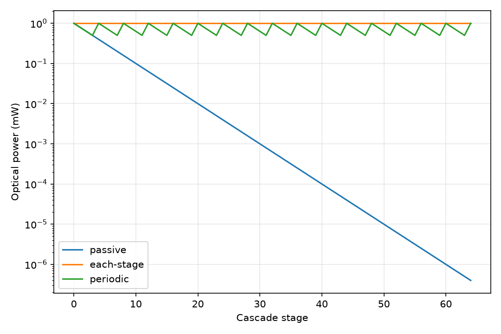
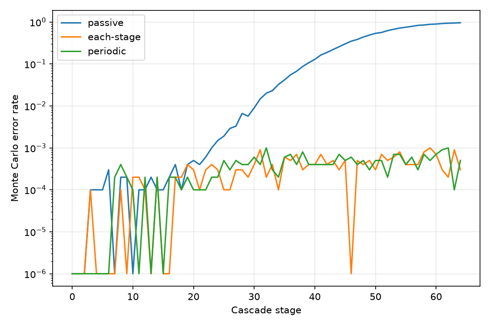

# LumenLatch

## 1. 研究の要約

LumenLatchは、光で状態を書き換え、保持し、その出力で次段の同種セルを駆動できる「カスケード可能な光学式1ビットセル」の成立可能性を検証する個人研究です。既存研究の証拠境界を整理し、損失、利得、信号復元、fan-out、保持、誤り、エネルギーを簡易モデルで監査します。完成した光コンピュータや実デバイスの設計を公開するものではなく、実証済み事項、仮定、未報告値、否定的結果を分けて示す初期スコーピング研究です。現時点ではPCM単セルの不揮発動作は実証されていますが、前段PCMの実出力だけで同種次段を書き換える多段カスケードは確認できていません。

## 現在の取り組み

LumenLatchは現在、実デバイス製作へ進む前の調査・設計・検証段階にあります。

### 現在地

- PCMによる光書込み・光読出し・不揮発保持は既存研究で実証済み
- 前段の同種セル出力だけで次段PCMセルを不揮発書換えする実証は未確認
- 完全受動の多段接続は現モデルでは成立しない
- 光増幅・信号再生は完全受動より改善するが、現行64段targetには未達
- 現在の`Q proxy`と`error_rate`は実デバイスBERとして未校正

### 現在進めていること

- 世界の研究室・研究者・試作設備と[接触routeの調査](research_landscape.md)
- PCMセル、光再生器、共振器、光電子hybrid方式の比較
- 既存デバイスの実測波形を用いたsoftware replayの準備
- pJ級PCM書込みに対する光エネルギー収支の監査
- 再生器のgain、noise、standby、heat densityを含むmodel改善
- 最小costで可能な卓上実験と既存chip検証routeの整理

### 次に確認すること

1. 既存研究者から代表的な入力・出力波形を取得できるか
2. 実測波形から必要gain、bandwidth、extinction ratio、noise marginを再計算する
3. All-optical再生とO/E/O再生のtotal energyを比較する
4. 共振器なし、low-Q resonator、DBR、photonic crystalを同条件で比較する
5. 新規fabへ進む価値がある成立marginを定義する

### 現時点の判断

最初に作るべきものは新規mask setではなく、正しいreference planeを持つ実測raw traceです。実測データによるreplayで成立余裕を確認した後にのみ、既存chip上の二段試験またはcustom two-cell試作へ進みます。研究者向けの最小データ依頼は[共通1ページ](collaboration_request.md)にまとめています。

## 2. 最重要の問い

> 前段セルの実出力が情報を保持したまま次段を確実に書き換え、必要最小限のpump／bias補給を含めても、段を重ねた際の論理レベル、消光比、fan-out、誤り率、総エネルギー、熱を成立させられるか。

外部pumpや電気biasからのエネルギー補給は、それ自体を失敗理由とはしません。情報を保ったまま次段駆動エネルギーを供給する正当なトランジスタ型機構として扱い、総energy、standby、heat、latency、area、fan-out、多段BER、E/O変換回数で比較します。

## 3. 現時点の結論

- **PCM単セルの不揮発保持は成立している。** GST導波路セルでは、光書込み、光読出し、8準位動作、最小13.4 pJの吸収書込み、少なくとも3か月の保持が報告されています。
- **PCM同種カスケードは未実証。** 前段PCMの実出力だけで次段PCMを不揮発書換えした実験は確認できていません。Feldmann 2017のcarryは外部書込みpulseの90:10分岐であり、第1 PCMの透過出力による駆動ではありません。
- **利得とlevel restorationの実証例はあるが、同じ機能境界ではない。** Fiber soliton NORの同型二段、各段Address pump付きpolariton transistorの二段などは重要な先行例ですが、集積性、不揮発保持、動作温度、外部pumpなどの条件がPCMセルと異なります。
- **現行64段モデルでは全戦略が受入目標に未達。** 再生方式は完全受動より改善しますが、実デバイス成立や実測BERを示すものではありません。
- **一つの万能方式はまだ選べない。** 低頻度の不揮発状態保持には可能性が残る一方、高頻度logicや通信での優位は示されていません。

根拠と技術別証拠は[研究要約](research_summary.md)と[出典・claim map](sources.csv)を参照してください。

## 4. 実証済み／未実証の境界

| 区分 | 現時点で言えること | 言えないこと |
|---|---|---|
| PCM単セル | 光書込み・光読出し・多値不揮発、13.4 pJ吸収書込み、少なくとも3か月保持は実証済み | 前段PCM出力だけによる同種次段PCM書換え、10年保持、高頻度書換えendurance |
| 同型二段 | Fiber soliton NORでは同型二段、polariton transistorでは二段switchingとrestorationの実証例がある | 室温・不揮発・集積PCMで同じ結果が得られること |
| SOA／laser／ring／PhC | 単セル、RAM、配列の実証例は多数ある | 同種多段でlink gain、fan-out、restoration、BERを同時に満たすこと |
| LumenLatchモデル | 仮定した条件間の感度と失敗条件を比較できる | 実測BER、製造歩留まり、wall-plug総energy、物理デバイスの実現可能性 |

本リポジトリでは、**experimentally demonstrated / conditional / simulation only / not demonstrated / currently difficult / NR（未報告）**を区別します。未報告値を他デバイスの一般値で埋めません。

## 5. 64段カスケード監査結果

現行モデルは、完全受動、各段理想再生、4段ごとの周期再生を1–64段で比較する**未校正の感度モデル**です。提案受入条件は`Q proxy >= 6 AND error_rate < 1e-9`ですが、これは文献実績ではなく評価用targetです。

| 戦略 | 64段 Q proxy | 64段 error_rate | 判定 |
|---|---:|---:|---|
| 完全受動 (`passive`) | -1.9996 | 0.9776 | **FAIL** |
| 各段理想再生 (`each-stage`) | 5.9636 | 0.0003 | **FAIL** |
| 4段ごと再生 (`periodic`, N=4) | 5.5844 | 0.0005 | **FAIL** |

この結果が示すのは、現行仮定では受動損失が急速に累積し、理想再生を置いても64段のAND条件を満たさないことです。一方、`Q proxy`は実測分布へfitしたQではなく、`error_rate`は有限回Monte Carloのevent failure率です。どちらもGaussian BERや実測BERではなく、モデルがPASSしても物理実証にはなりません。式、CSV整合性、再生器仮定は[モデル監査](model.md)に記録しています。





## 6. 13.4 pJのエネルギー境界

**13.4 ± 0.6 pJはwall-plug system energyではありません。** Ríos et al. 2015 Supplementary S5/Table S2の1 µm GSTセルについて、既知の吸収と測定pump pulseから算出された**GST/PCM吸収地点の光エネルギー**です。

実験経路の`CW diode laser → EOM → EDFA → fiber/grating coupler → waveguide → GST`において、13.4 pJにはlaser E/O損失、EOM、EDFA、fiber/coupler、制御、冷却、standbyは含まれません。上流を含む境界は次式で分離します。

`E_laser_elec = E_PCM_abs / (eta_abs * eta_waveguide * eta_split * eta_coupling * eta_laser_EO)`

異なる機能境界のSRAM access、on-chip link、HBM I/O、算術operationと13.4 pJを直接順位付けしません。component境界、3 scenario、240 operating points、電子方式との比較は[システムエネルギー監査](system_energy_audit.md)を参照してください。

## 7. 4方式の比較と暫定判定

| 方式 | 得られるもの | 主な不足・負担 | 暫定判定 |
|---|---|---|---|
| 完全受動PCM | 追加pumpなし、E/O変換なし、低static候補 | gainなし、損失とfan-out制約、64段条件FAIL | **数値上不成立** |
| 外部CWポンプ全光信号 | 光経路のまま局所energy補給とgainの候補 | pump込みenergy、CW heat、area、PCM同種多段が未確定 | **parameter不足** |
| 電気バイアス光再生 | SOA等によるgain／restoration候補、光経路は維持 | bias、ASE、heat、standby、多段BERが未確定 | **条件付き** |
| 光電子ハイブリッド | detector／logic／modulatorで3Rとfan-outを最も構成しやすい | 段ごとのO/E+E/O、clock、laser、遅延、area | **条件付き** |

この判定は外部pumpやbiasの存在だけで決めたものではありません。比較軸と詳細な技術別評価は[研究要約](research_summary.md)および[要件・評価カバレッジ](requirements.md)にあります。

## 8. 用途ごとの現在の見立て

| 用途 | 現在の判定 | 理由 |
|---|---|---|
| 高頻度logic | **不利** | 高activity時の発熱、endurance、BERが未確定 |
| 不揮発memory | **条件付き** | 保持は実証済みだがsystem write/read energy、endurance、array yieldが不足 |
| AI weight保持 | **有望** | 低頻度programと不揮発多値が適合。read、ADC、laser総電力は要評価 |
| 再構成可能routing | **有望** | 低activityなら不揮発保持を活かせる可能性。ER、loss、thermal driftは要評価 |
| Chip-to-chip通信 | **不利** | PCM writeとbit transferは別機能で、source／receiverを含む境界が未評価 |
| 行列演算 | **条件付き** | Weight保持には候補だが、MAC全体のlaser、detector、ADC、memory trafficが未評価 |
| 低頻度状態記憶 | **有望** | Write頻度が低ければ不揮発保持を活かせる可能性 |

「有望」は競合技術へのenergy優位を意味しません。13.4 pJ単体から用途の優劣を結論せず、同一機能・同一測定境界で比較する必要があります。

## 9. モデルの限界

現行モデルは実デバイスへ校正した予測器ではありません。主な未モデル／未評価項目は次のとおりです。

- ASE、RIN、shot noise、receiver noise、timing jitter、実PRBS BER
- Pump depletion、gain saturation、波長detuning、偏光、back-reflection、位相
- Thermal drift／cross-talk、温度による閾値・保持・吸収の変化
- 実arrayのthreshold分布、空間相関、校正後CV、歩留まり
- Endurance劣化、read disturb、write errorの実測分布
- Laser wall-plug、CW pump、bias、thermal control、cooling、standby
- Detector、control、clock、ADC/DACを含むシステム境界

評価targetと不足parameterの全体像は[要件・評価カバレッジ](requirements.md)と[シミュレーション計画](simulation_plan.md)を参照してください。

## 10. 次フェーズの最重要2課題

1. **PCM write energy budgetの実測** — pJ級書込みをPCM吸収面からlaser wall-plugまで同時測定し、coupling、waveguide、split、laser E/O、制御、static powerを分離して二重計上を防ぐ。
2. **Q／BERのreal-noise校正** — ASE、RIN、shot noise、receiver、timingを個別測定し、`Q proxy`、Gaussian analytical BER、event failureを分離して、多段PRBS BERへ接続する。

測定項目とsweep計画は[シミュレーション計画](simulation_plan.md)にまとめています。

## 11. 成果物・再現方法・詳細資料

| 成果物 | 内容 |
|---|---|
| [research_summary.md](research_summary.md) | 一次資料に基づく研究要約、技術別証拠、実証境界 |
| [research_landscape.md](research_landscape.md) | 研究者・研究室の現在方向、接触優先順位、最小costの検証route |
| [collaboration_request.md](collaboration_request.md) | 研究者へ送る最小raw-trace依頼の共通1ページ |
| [sources.csv](sources.csv) | DOI、URL、各文献が支えるclaimの一覧 |
| [requirements.md](requirements.md) | 提案target、証拠区分、評価カバレッジ |
| [model.md](model.md) | Q／error定義、64段監査、CSV整合性、再生器仮定 |
| [simulation_plan.md](simulation_plan.md) | 不足parameter、測定設計、Phase 2計画 |
| [simulation_results.csv](simulation_results.csv) | 3戦略×1–64段の192行cascade結果 |
| [simulate_optical_cell.py](simulate_optical_cell.py) | Cascade感度モデルと8図の生成コード |
| [figures/](figures/) | 既存8枚の感度図 |
| [system_energy_audit.md](system_energy_audit.md) | 13.4 pJ境界、component分離、用途判定、電子比較 |
| [system_energy_budget.csv](system_energy_budget.csv) | 3 scenario×80 operating pointsの240行energy budget |
| [system_energy_model.py](system_energy_model.py) | System energy計算コード |
| [tests/](tests/) | Cascade 8 test＋system energy 7 test |

### 再現方法（Windows Git Bash）

```bash
uv venv .venv --python 3.11
uv pip install --python .venv/Scripts/python.exe -r requirements.txt
./.venv/Scripts/python.exe simulate_optical_cell.py --output-dir . --seed 20260715 --trials 10000
./.venv/Scripts/python.exe system_energy_model.py --output system_energy_budget.csv
./.venv/Scripts/python.exe -m pytest tests -q
sha256sum simulation_results.csv system_energy_budget.csv
```

基準SHA-256：

- `simulation_results.csv`: `2de08f6d7744aea0a6c2db67e7bb25a48691b85ae115b3a80e59d9d2bd0b2dbf`
- `system_energy_budget.csv`: `6d2c8da6e827ff89b043b1f6f6047240e4d53ce0197556d456faa9ff98526045`

## 12. 図の条件に関する注意

READMEに埋め込んだ`stages_vs_error_rate.png`はCSV各行の直接プロットではなく、別の感度条件によるstage sweepです。Stage 0–64、ER=10 dB、保持時間24 h、温度25 °C、threshold CV=0.05、gain noise=0.35 dB、write error=1e-5、read disturb=1e-6、周期再生間隔4を用い、seedは`base seed + strategy offset + stage`です。

`temperature_vs_error_rate.png`と`variation_vs_error_rate.png`もER=10 dB・保持時間24 hを基準とし、それぞれ温度またはthreshold CVだけを掃引します。これら3図のerror rateを、劣化後ERと2160 h保持を使う[simulation_results.csv](simulation_results.csv)の値として読んではなりません。全8図の定義は[生成コード](simulate_optical_cell.py)で確認できます。

## ライセンス

Copyright 2026 DwarfM42

- Pythonコード（`*.py`、testsを含む）：[Apache License 2.0](LICENSE-APACHE-2.0.txt)
- 文書・図・データを含むその他のオリジナル研究成果物：[Creative Commons Attribution 4.0 International（CC BY 4.0）](LICENSE-CC-BY-4.0.txt)

適用範囲、推奨クレジット、第三者資料の扱いは[LICENSE](LICENSE)を参照してください。